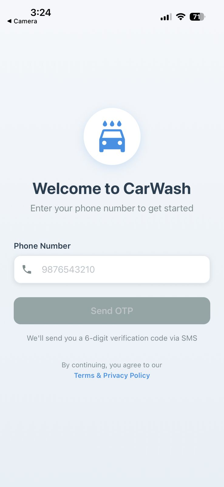
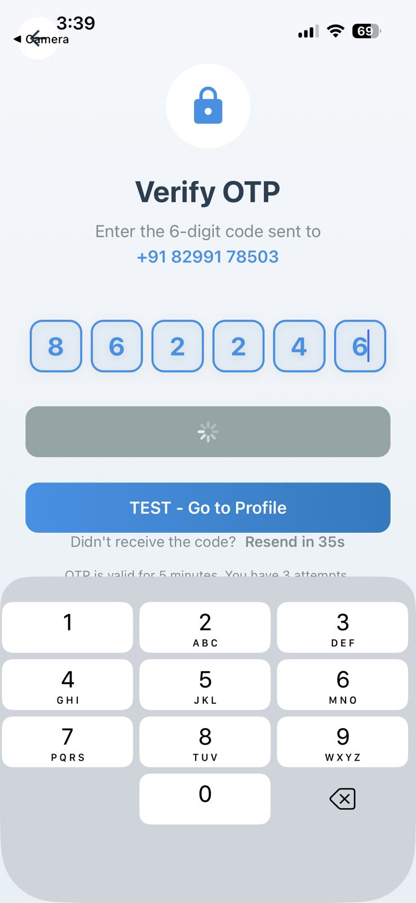
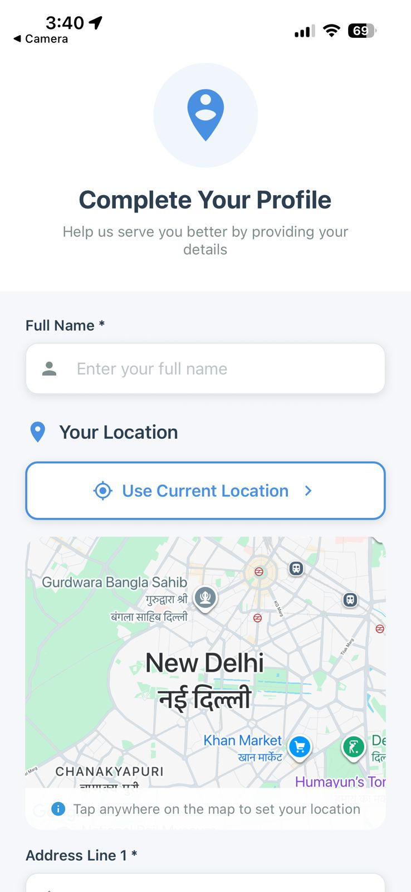
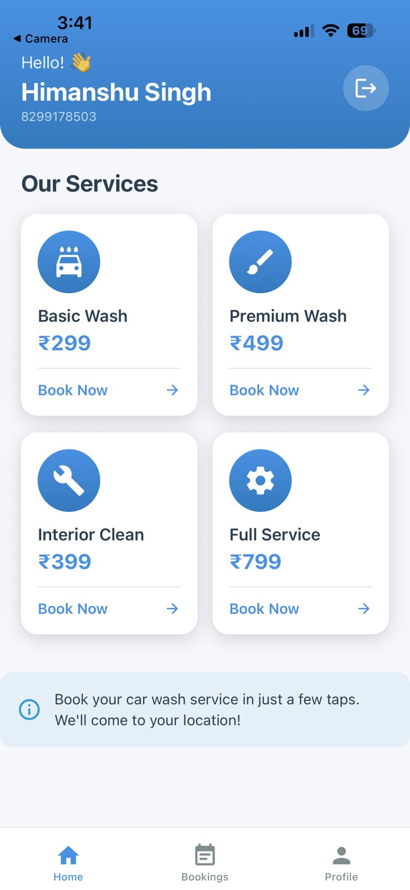
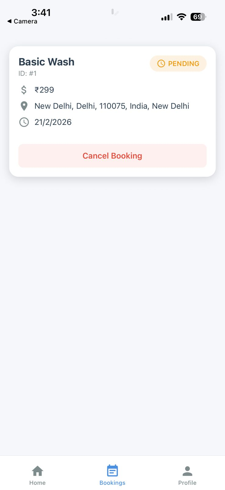
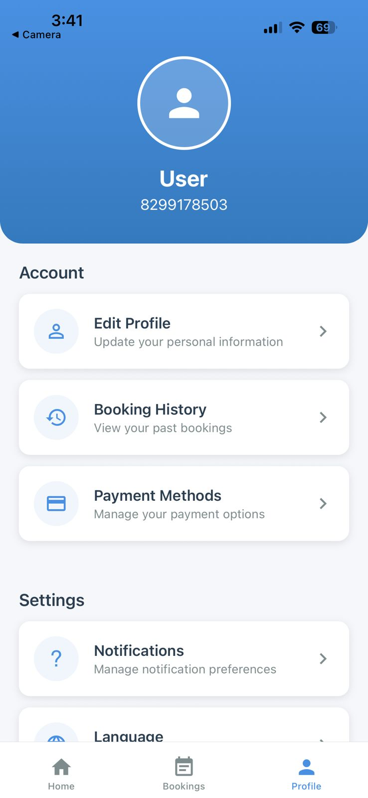

# 🚗 CarWash - Mobile App

A modern, user-friendly car wash booking mobile application built with React Native and Expo.


---

## 📋 Table of Contents

- [Overview](#overview)
- [Features](#features)
- [Screenshots](#screenshots)
- [Tech Stack](#tech-stack)
- [Architecture](#architecture)
- [Getting Started](#getting-started)
- [Project Structure](#project-structure)
- [Configuration](#configuration)
- [API Integration](#api-integration)
- [State Management](#state-management)
- [Navigation](#navigation)
- [Authentication](#authentication)
- [Building & Deployment](#building--deployment)
- [Troubleshooting](#troubleshooting)
- [Contributing](#contributing)
- [License](#license)

---

## 🎯 Overview

CarWash is a comprehensive mobile application that allows users to book professional car wash services at their doorstep. Built with React Native and Expo, the app provides a seamless, intuitive experience for both iOS and Android platforms.

### 🌟 Why CarWash?

- 📱 **Cross-Platform** - Single codebase for iOS & Android
- 🔐 **Secure & Passwordless** - SMS OTP authentication
- 🗺️ **Location-Based** - GPS-enabled service booking
- 💳 **Easy Booking** - Book services in just 3 taps
- 📊 **Track History** - View all past and upcoming bookings
- 🎨 **Beautiful UI** - Modern gradient design with smooth animations

---

## ✨ Features

### 🔐 Authentication
- ✅ **Passwordless Login** - SMS OTP-based authentication
- ✅ **Auto-Login** - Stay logged in after closing app
- ✅ **Secure Storage** - JWT tokens stored securely
- ✅ **One-Time Setup** - Login once, use forever (until logout/uninstall)

### 👤 User Profile
- ✅ **Profile Setup** - Complete profile with name and address
- ✅ **GPS Integration** - Automatic location detection
- ✅ **Interactive Maps** - Tap to select exact location
- ✅ **Address Management** - Save and update address details
- ✅ **Profile Completion Tracking** - Know your profile status

### 🚗 Booking Services
- ✅ **Multiple Services** - Basic Wash, Premium Wash, Interior Clean, Full Service
- ✅ **Price Transparency** - Clear pricing for all services
- ✅ **Quick Booking** - Book with just a few taps
- ✅ **Booking History** - View all past bookings
- ✅ **Status Tracking** - Track booking status in real-time
- ✅ **Cancel Bookings** - Cancel pending bookings easily

### 🎨 User Experience
- ✅ **Beautiful Gradients** - Modern, eye-catching design
- ✅ **Smooth Animations** - Fluid transitions and interactions
- ✅ **Responsive UI** - Works perfectly on all screen sizes
- ✅ **Loading States** - Clear feedback during operations
- ✅ **Error Handling** - User-friendly error messages
- ✅ **Offline Support** - Handle network errors gracefully

---

## 📱 Screenshots

<div align="center">
  
  
  
  
</div>

<div align="center">
  
  
</div>

---

## 🛠️ Tech Stack

### Core Framework
- **React Native** - Mobile app framework
- **Expo 50** - Development platform and tools
- **React Navigation 6** - Navigation library
- **Axios** - HTTP client for API calls

### UI/UX Libraries
- **React Native Vector Icons** - Icon library
- **Expo Linear Gradient** - Gradient backgrounds
- **React Native Maps** - Google Maps integration
- **Expo Location** - GPS and location services

### State Management
- **React Context API** - Global state management
- **React Hooks** - Component state and effects
- **AsyncStorage** - Persistent local storage

### Development Tools
- **Expo CLI** - Development server and tools
- **Metro Bundler** - JavaScript bundler
- **Expo Go** - Testing on physical devices
- **React DevTools** - Debugging

---

## 🏗️ Architecture

```
┌─────────────────────────────────────────────────────────────┐
│                     Mobile App (React Native)               │
└─────────────────────────────────────────────────────────────┘
                              │
                    ┌─────────┴─────────┐
                    │                   │
            ┌───────▼───────┐   ┌──────▼──────┐
            │  Navigation   │   │    State    │
            │   (Screens)   │   │ (Context)   │
            └───────┬───────┘   └──────┬──────┘
                    │                   │
        ┌───────────┼───────────────────┼───────────┐
        │           │                   │           │
    ┌───▼───┐   ┌──▼──┐           ┌────▼────┐  ┌──▼──┐
    │ Auth  │   │User │           │ Booking │  │ UI  │
    │Screens│   │Scr. │           │ Screens │  │Comp.│
    └───┬───┘   └──┬──┘           └────┬────┘  └─────┘
        │          │                   │
        └──────────┼───────────────────┘
                   │
            ┌──────▼──────┐
            │  API Client │
            │   (Axios)   │
            └──────┬──────┘
                   │
                   ▼
        ┌─────────────────────┐
        │   Backend API       │
        │  (API Gateway)      │
        │   Port: 8080        │
        └─────────────────────┘
```

### App Flow

```
App Start
   ↓
Check AsyncStorage for Token
   ↓
   ├─→ Token Found → Validate → Load Profile → Home Screen
   │
   └─→ No Token → Login Screen
                      ↓
                  Send OTP
                      ↓
                  Verify OTP
                      ↓
                  Save Token
                      ↓
                Check Profile
                      ↓
              ├─→ Profile Complete → Home Screen
              │
              └─→ Profile Incomplete → Profile Setup
                                          ↓
                                      Complete Profile
                                          ↓
                                      Home Screen
```

---

## 🚀 Getting Started

### Prerequisites

- Node.js 18+ ([Download](https://nodejs.org/))
- npm or yarn
- Expo CLI (`npm install -g expo-cli`)
- iOS Simulator (Mac only) or Android Studio
- Expo Go app on your phone (for testing)

### Installation

1. **Clone the repository**
```bash
git clone https://github.com/himanshuxoox/CarWashApp_mobileapp.git
cd CarWashApp_mobileapp
```

2. **Install dependencies**
```bash
npm install
# or
yarn install
```

3. **Configure environment**

Create/update `src/constants/config.js`:

```javascript
export const API_BASE_URL = 'http://YOUR_IP:8080'; // Replace with your backend IP

export const API_ENDPOINTS = {
  SEND_OTP: '/auth/send-otp',
  VERIFY_OTP: '/auth/verify-otp',
  RESEND_OTP: '/auth/resend-otp',
  USER_PROFILE: '/users/profile',
  BOOKINGS: '/bookings',
};
```

**Important:** 
- For testing on physical device, use your computer's IP address
- Find IP: `ipconfig` (Windows) or `ifconfig` (Mac/Linux)
- Example: `http://192.168.1.100:8080`

4. **Start the development server**
```bash
npx expo start
```

5. **Run on your device/simulator**

- **iOS Simulator:** Press `i` in terminal
- **Android Emulator:** Press `a` in terminal  
- **Physical Device:** Scan QR code with Expo Go app

---

## 📁 Project Structure

```
CarWashApp_mobileapp/
├── src/
│   ├── api/                    # API integration
│   │   ├── axiosConfig.js      # Axios instance with interceptors
│   │   ├── authApi.js          # Authentication API calls
│   │   ├── userApi.js          # User profile API calls
│   │   └── bookingApi.js       # Booking API calls
│   │
│   ├── components/             # Reusable components
│   │   ├── Button.js           # Custom button component
│   │   ├── Input.js            # Custom input component
│   │   └── OtpInput.js         # OTP input component
│   │
│   ├── constants/              # App constants
│   │   ├── colors.js           # Color palette & gradients
│   │   └── config.js           # API URLs & app config
│   │
│   ├── context/                # React Context
│   │   └── AuthContext.js      # Authentication state
│   │
│   ├── navigation/             # Navigation setup
│   │   ├── AppNavigator.js     # Root navigator
│   │   ├── AuthNavigator.js    # Auth flow navigation
│   │   └── MainNavigator.js    # Main app navigation
│   │
│   ├── screens/                # App screens
│   │   ├── auth/
│   │   │   ├── LoginScreen.js
│   │   │   └── OtpVerificationScreen.js
│   │   │
│   │   ├── profile/
│   │   │   ├── ProfileSetupScreen.js
│   │   │   └── ProfileScreen.js
│   │   │
│   │   ├── home/
│   │   │   └── HomeScreen.js
│   │   │
│   │   └── bookings/
│   │       └── BookingsScreen.js
│   │
│   └── utils/                  # Utility functions
│       ├── storage.js          # AsyncStorage helpers
│       ├── validation.js       # Form validation
│       └── logger.js           # API logging
│
├── assets/                     # Images, fonts, etc.
├── app.json                    # Expo configuration
├── App.js                      # Root component
├── package.json                # Dependencies
└── README.md                   # This file
```

---

## ⚙️ Configuration

### App Configuration (`app.json`)

```json
{
  "expo": {
    "name": "CarWash",
    "slug": "carwash-mobile",
    "version": "1.0.0",
    "orientation": "portrait",
    "icon": "./assets/icon.png",
    "splash": {
      "image": "./assets/splash.png",
      "resizeMode": "contain",
      "backgroundColor": "#6366f1"
    },
    "ios": {
      "bundleIdentifier": "com.carwash.mobile",
      "supportsTablet": true,
      "infoPlist": {
        "NSLocationWhenInUseUsageDescription": "CarWash needs your location to provide nearby services"
      }
    },
    "android": {
      "package": "com.carwash.mobile",
      "adaptiveIcon": {
        "foregroundImage": "./assets/adaptive-icon.png",
        "backgroundColor": "#6366f1"
      },
      "permissions": [
        "ACCESS_FINE_LOCATION",
        "ACCESS_COARSE_LOCATION"
      ],
      "config": {
        "googleMaps": {
          "apiKey": "YOUR_GOOGLE_MAPS_API_KEY"
        }
      }
    }
  }
}
```

### API Configuration (`src/constants/config.js`)

```javascript
// Find your computer's IP address
// Windows: ipconfig
// Mac/Linux: ifconfig
export const API_BASE_URL = 'http://192.168.1.100:8080';

export const API_ENDPOINTS = {
  SEND_OTP: '/auth/send-otp',
  VERIFY_OTP: '/auth/verify-otp',
  RESEND_OTP: '/auth/resend-otp',
  USER_PROFILE: '/users/profile',
  BOOKINGS: '/bookings',
};

export const APP_CONFIG = {
  OTP_LENGTH: 6,
  OTP_RESEND_TIMEOUT: 60,
  PHONE_NUMBER_LENGTH: 10,
  COUNTRY_CODE: '+91',
};

export const SERVICE_TYPES = {
  BASIC_WASH: 'BASIC_WASH',
  PREMIUM_WASH: 'PREMIUM_WASH',
  INTERIOR_CLEAN: 'INTERIOR_CLEAN',
  FULL_SERVICE: 'FULL_SERVICE',
};

export const BOOKING_STATUS = {
  PENDING: 'PENDING',
  CONFIRMED: 'CONFIRMED',
  IN_PROGRESS: 'IN_PROGRESS',
  COMPLETED: 'COMPLETED',
  CANCELLED: 'CANCELLED',
};
```

---

## 🔌 API Integration

### Axios Configuration

```javascript
// src/api/axiosConfig.js
import axios from 'axios';
import { API_BASE_URL } from '../constants/config';
import { getToken } from '../utils/storage';

const axiosInstance = axios.create({
  baseURL: API_BASE_URL,
  timeout: 15000,
  headers: {
    'Content-Type': 'application/json',
  },
});

// Request interceptor - Add JWT token
axiosInstance.interceptors.request.use(
  async (config) => {
    const token = await getToken();
    if (token) {
      config.headers.Authorization = `Bearer ${token}`;
    }
    return config;
  },
  (error) => Promise.reject(error)
);

// Response interceptor - Handle errors
axiosInstance.interceptors.response.use(
  (response) => response.data,
  (error) => {
    if (error.response?.status === 401) {
      // Handle unauthorized - logout user
    }
    return Promise.reject(error);
  }
);

export default axiosInstance;
```

### API Usage Example

```javascript
// src/api/bookingApi.js
import axiosInstance from './axiosConfig';
import { API_ENDPOINTS } from '../constants/config';

export const createBooking = async (bookingData) => {
  try {
    const response = await axiosInstance.post(
      `${API_ENDPOINTS.BOOKINGS}?userName=${bookingData.userName}`,
      bookingData
    );
    return response;
  } catch (error) {
    throw error;
  }
};

export const getAllBookings = async () => {
  try {
    const response = await axiosInstance.get(API_ENDPOINTS.BOOKINGS);
    return response;
  } catch (error) {
    throw error;
  }
};
```

---

## 🎯 State Management

### AuthContext

```javascript
// src/context/AuthContext.js
const AuthContext = createContext({});

export const AuthProvider = ({ children }) => {
  const [isLoading, setIsLoading] = useState(true);
  const [isAuthenticated, setIsAuthenticated] = useState(false);
  const [hasProfile, setHasProfile] = useState(false);
  const [token, setToken] = useState(null);
  const [phoneNumber, setPhoneNumber] = useState(null);
  const [user, setUser] = useState(null);

  // Check for saved token on app start
  useEffect(() => {
    checkAuthStatus();
  }, []);

  const checkAuthStatus = async () => {
    const storedToken = await getToken();
    if (storedToken) {
      // Auto-login user
      setIsAuthenticated(true);
      // Load user profile
    }
    setIsLoading(false);
  };

  const login = async (phone, otp) => {
    const response = await verifyOtp(phone, otp);
    await saveToken(response.token);
    setIsAuthenticated(true);
  };

  const logout = async () => {
    await clearAllData();
    setIsAuthenticated(false);
  };

  return (
    <AuthContext.Provider value={{
      isLoading,
      isAuthenticated,
      hasProfile,
      user,
      login,
      logout
    }}>
      {children}
    </AuthContext.Provider>
  );
};

export const useAuth = () => useContext(AuthContext);
```

---

## 🧭 Navigation

### Navigation Structure

```javascript
AppNavigator
├── AuthNavigator (if not authenticated)
│   ├── Login Screen
│   ├── OTP Verification Screen
│   └── Profile Setup Screen
│
└── MainNavigator (if authenticated with profile)
    ├── Home Screen (Tab)
    ├── Bookings Screen (Tab)
    └── Profile Screen (Tab)
```

### Implementation

```javascript
// src/navigation/AppNavigator.js
const AppNavigator = () => {
  const { isLoading, isAuthenticated, hasProfile } = useAuth();

  if (isLoading) {
    return <LoadingScreen />;
  }

  const shouldShowMainApp = isAuthenticated && hasProfile;

  return (
    <NavigationContainer>
      {shouldShowMainApp ? <MainNavigator /> : <AuthNavigator />}
    </NavigationContainer>
  );
};
```

---

## 🔐 Authentication

### Authentication Flow

1. **User enters phone number** → Send OTP request
2. **Backend sends SMS** via Fast2SMS
3. **User enters OTP** → Verify OTP
4. **Backend validates** → Returns JWT token
5. **App saves token** → AsyncStorage
6. **Check profile** → Complete or incomplete
7. **Navigate** → Profile Setup or Home

### Persistent Login

```javascript
// On app start
const token = await AsyncStorage.getItem('@carwash_token');

if (token) {
  // User is logged in - auto-login
  setIsAuthenticated(true);
  loadUserProfile();
} else {
  // User needs to login
  showLoginScreen();
}
```

### Token Storage

```javascript
// src/utils/storage.js
import AsyncStorage from '@react-native-async-storage/async-storage';

export const saveToken = async (token) => {
  await AsyncStorage.setItem('@carwash_token', token);
};

export const getToken = async () => {
  return await AsyncStorage.getItem('@carwash_token');
};

export const clearAllData = async () => {
  await AsyncStorage.multiRemove([
    '@carwash_token',
    '@carwash_phone',
  ]);
};
```

---

## 📦 Building & Deployment

### Development Build

```bash
# Start development server
npx expo start

# Clear cache
npx expo start -c
```

### Production Build

#### iOS (requires Mac)

```bash
# Install EAS CLI
npm install -g eas-cli

# Login to Expo
eas login

# Configure build
eas build:configure

# Build for iOS
eas build --platform ios

# Submit to App Store
eas submit --platform ios
```

#### Android

```bash
# Build APK for testing
eas build --platform android --profile preview

# Build AAB for Play Store
eas build --platform android --profile production

# Submit to Play Store
eas submit --platform android
```

### Environment Setup

Create `eas.json`:

```json
{
  "build": {
    "development": {
      "developmentClient": true,
      "distribution": "internal"
    },
    "preview": {
      "distribution": "internal",
      "android": {
        "buildType": "apk"
      }
    },
    "production": {
      "android": {
        "buildType": "app-bundle"
      },
      "ios": {
        "buildType": "app-store"
      }
    }
  }
}
```

---

## 🐛 Troubleshooting

### Common Issues

#### 1. Network Error - Cannot connect to backend

**Problem:** `Network Error` when calling APIs

**Solution:**
```javascript
// Use your computer's IP, not localhost
// Find IP: ipconfig (Windows) or ifconfig (Mac/Linux)
export const API_BASE_URL = 'http://192.168.1.100:8080';

// Ensure:
// 1. Backend is running on 0.0.0.0, not 127.0.0.1
// 2. Phone and computer on same WiFi
// 3. Firewall allows connections
```

#### 2. Maps not showing

**Problem:** Google Maps not displaying

**Solution:**
```javascript
// Add Google Maps API key in app.json
"android": {
  "config": {
    "googleMaps": {
      "apiKey": "YOUR_API_KEY_HERE"
    }
  }
}

// Get API key from: https://console.cloud.google.com/
```

#### 3. Location permission denied

**Problem:** Cannot access GPS location

**Solution:**
```javascript
// Ensure permissions in app.json
"ios": {
  "infoPlist": {
    "NSLocationWhenInUseUsageDescription": "..."
  }
},
"android": {
  "permissions": ["ACCESS_FINE_LOCATION"]
}

// Request permission in code
const { status } = await Location.requestForegroundPermissionsAsync();
```

#### 4. App crashes on startup

**Solution:**
```bash
# Clear cache and reinstall
npx expo start -c
rm -rf node_modules
npm install
```

#### 5. AsyncStorage not working

**Solution:**
```bash
# Install AsyncStorage
npx expo install @react-native-async-storage/async-storage

# Clear app data on device
# Settings → Apps → CarWash → Clear Data
```

---

## 🧪 Testing

### Manual Testing Checklist

- [ ] Login with OTP
- [ ] Auto-login after app restart
- [ ] Profile setup with GPS
- [ ] Profile setup with manual address
- [ ] Book each service type
- [ ] View booking history
- [ ] Cancel pending booking
- [ ] Logout and login again
- [ ] Test on iOS and Android
- [ ] Test on different screen sizes

### Test Accounts

Use these phone numbers for testing (OTP: any 6 digits in test mode):
- 8299178503
- 9876543210

---

## 🎨 Customization

### Change Theme Colors

```javascript
// src/constants/colors.js
export const COLORS = {
  primary: '#6366f1',      // Main brand color
  secondary: '#8b5cf6',    // Secondary brand color
  success: '#10b981',      // Success states
  error: '#ef4444',        // Error states
  warning: '#f59e0b',      // Warning states
  
  gradient: {
    primary: ['#667eea', '#764ba2'],
    background: ['#f8f9fa', '#e9ecef'],
  }
};
```

### Add New Service

```javascript
// src/screens/home/HomeScreen.js
const services = [
  // ... existing services
  { 
    id: 5, 
    icon: 'cleaning-services', 
    title: 'Deep Clean', 
    price: 999,
    type: 'DEEP_CLEAN'
  },
];
```

---

## 🤝 Contributing

Contributions are welcome! Please follow these guidelines:

1. Fork the repository
2. Create a feature branch (`git checkout -b feature/AmazingFeature`)
3. Commit your changes (`git commit -m 'Add some AmazingFeature'`)
4. Push to the branch (`git push origin feature/AmazingFeature`)
5. Open a Pull Request

### Code Style

- Use functional components with hooks
- Follow React Native best practices
- Write descriptive variable names
- Add comments for complex logic
- Keep components small and focused

---
---

## 👥 Team

- **Himanshu Singh** - *Lead Developer* - [@himanshuxoox](https://github.com/himanshuxoox)

---

## 🙏 Acknowledgments

- React Native community
- Expo team
- All open-source contributors

---

## 📞 Support

For support and queries:
- 📧 Email: himanshu@example.com
- 🐛 Issues: [GitHub Issues](https://github.com/himanshuxoox/CarWashApp_mobileapp/issues)
- 💬 Discussions: [GitHub Discussions](https://github.com/himanshuxoox/CarWashApp_mobileapp/discussions)

---

## 🔗 Related Links

- **Backend Repository:** [CarWash Backend](https://https://github.com/himanshuxoox/car-wash-backend-all)


---

<div align="center">
  <h3>Built with ❤️ using React Native & Expo</h3>
  <p>⭐ Star this repository if you find it helpful!</p>
  
  <p>
    <a href="https://github.com/himanshuxoox/CarWashApp_mobileapp/stargazers">
      
    </a>
    <a href="https://github.com/himanshuxoox/CarWashApp_mobileapp/network/members">
      
    </a>
  </p>
</div>

---

## 📝 Changelog

### Version 1.0.0 (2026-02-21)
- ✅ Initial release
- ✅ SMS OTP authentication
- ✅ Profile setup with GPS
- ✅ Service booking
- ✅ Booking history
- ✅ Persistent login

### Upcoming Features
- 🔜 Payment integration
- 🔜 Push notifications
- 🔜 Real-time tracking
- 🔜 Rating & reviews
- 🔜 Referral program
- 🔜 Multiple addresses

---

<div align="center">
  <p>Made with ❤️ by Himanshu Singh</p>
  <p>⭐ Star this repository if you find it helpful!</p>
</div>

